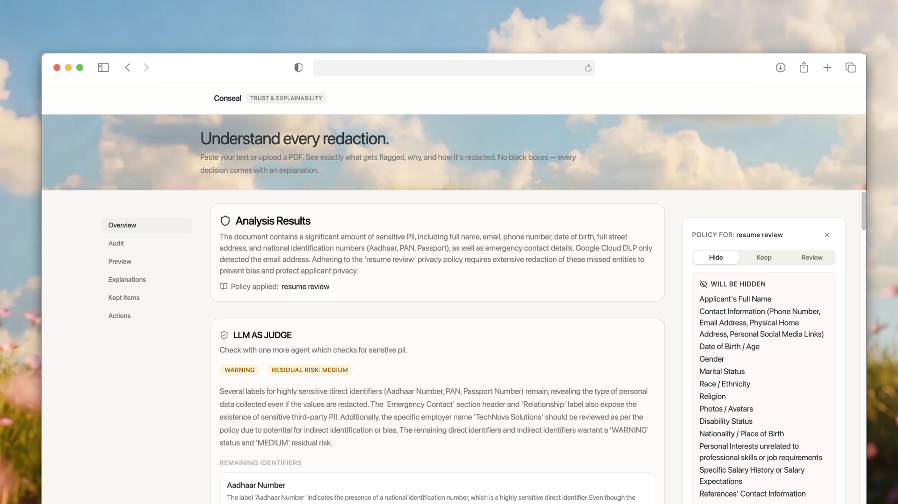
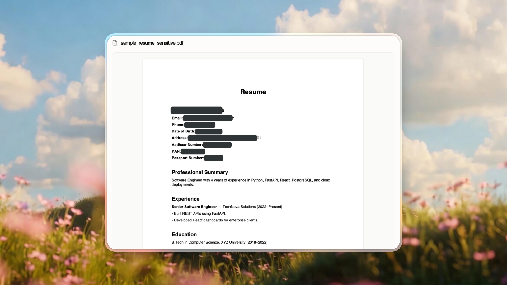
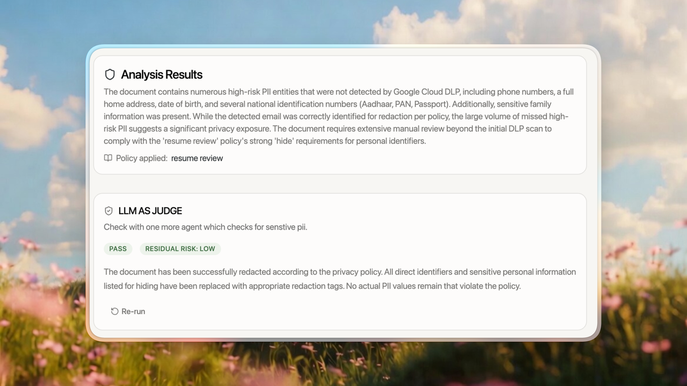

# Conseal – Explainable AI Document Anonymization


<p align="left">
  <a href="https://nextjs.org"></a>
  <a href="https://react.dev"></a>
  <a href="https://tailwindcss.com"></a>
  <a href="https://bun.sh"></a>
  <a href="https://fastapi.tiangolo.com"></a>
  <a href="https://www.python.org"></a>
  <a href="https://deepmind.google/technologies/gemini/"></a>
</p>

## Overview

Conseal is an explainable document anonymization platform designed to help users safely share documents with external AI tools without exposing sensitive information.

Unlike traditional PII redaction tools that simply hide detected information, Conseal focuses on **building user trust** by making every redaction transparent, explainable, and aligned with the user's intended purpose.

This project is built for **Problem Statement 1 – Trust & Explainability**.

---

# The Problem

Users increasingly rely on AI assistants to analyze resumes, contracts, medical reports, financial documents, and other sensitive files.

However, before sharing these documents, they need confidence that:

* Sensitive information has been removed.
* Nothing important has been unnecessarily hidden.
* Every redaction has a clear explanation.
* The document is safe to share.

Most existing tools behave like black boxes.

Conseal aims to replace blind trust with explainable decisions.

---

# Core Idea

Instead of asking only:

> **"What is PII?"**

Conseal first asks:

> **"Why are you sharing this document with AI?"**

The intended purpose becomes the foundation for all privacy decisions.

For example:

* Resume Review
* Contract Analysis
* Medical Analysis
* Financial Analysis
* General AI Assistant
* Custom Purpose

Different use cases require different privacy strategies.

This ensures the AI keeps information that is useful while removing information that could identify people or organizations.

---

# Solution Architecture

```text
                 Upload PDF
                      │
                      ▼
          Select AI Purpose
                      │
                      ▼
         Policy Generation Agent
                      │
                      ▼
            Privacy Strategy
                      │
                      ▼
      Microsoft Presidio Detection
                      │
                      ▼
        LLM Context Review Agent
                      │
                      ▼
        Explainable Redaction
                      │
                      ▼
        Interactive PDF Review
                      │
         ┌────────────┴────────────┐
         ▼                         ▼
 Privacy Audit (Optional)   Download Redacted PDF
```

---

# Architecture Components

## 1. Purpose Selection


Before any analysis begins, the user specifies why the document will be shared with an AI.

Examples:

* Resume Review
* Legal Analysis
* Medical Analysis
* Financial Analysis
* General AI Chat

This allows the system to make context-aware privacy decisions instead of blindly removing every detected entity.

---

## 2. Policy Generation Agent


An ADK agent generates a privacy strategy based on the selected purpose.

The strategy categorizes information into:

* Hide
* Keep
* Review

Users can modify the generated strategy before continuing.

---

## 3. PII Detection Layer

Microsoft Presidio acts as the primary detection engine.

Responsibilities include:

* Detecting standard PII
* Returning confidence scores
* Producing structured entity information
* Performing deterministic detection

---

## 4. LLM Context Review

The LLM complements Presidio rather than replacing it.

Responsibilities include:

* Detecting contextual identifiers
* Resolving ambiguous entities
* Validating detections against the selected privacy strategy
* Generating human-readable explanations

---

## 5. Interactive PDF Review


Instead of displaying extracted text, the application renders the original PDF.

Users can:

* Review highlighted entities
* Inspect explanations
* View confidence scores
* Accept or modify recommendations

The original PDF is never modified during review.

---

## 6. Redacted PDF Generation

After the review is complete, the backend applies permanent redactions to the original PDF and generates a downloadable redacted document.

---

## 7. Optional Privacy Audit


For users who want additional assurance, Conseal provides an optional Privacy Audit.

The audit:

* Independently reviews the final redacted content
* Attempts to identify any remaining sensitive information
* Reports residual privacy risk
* Never modifies the document

This feature acts as a second opinion before the document is shared with an external AI.

---

# Design Principles

* Purpose-driven privacy
* Explainable decisions
* Human-in-the-loop review
* Context-aware anonymization
* Trust over automation
* Preserve document utility while protecting privacy

---

# MVP Features

* Upload PDF
* Purpose selection
* AI-generated privacy strategy
* Editable privacy policy
* Microsoft Presidio integration
* LLM contextual review
* Interactive PDF review
* Explainable redactions
* Download permanently redacted PDF
* Optional Privacy Audit

---

# Technology Stack

## Frontend

* Next.js
* React
* Tailwind CSS
* react-pdf
* PDF.js

## Backend

* FastAPI
* Microsoft Presidio
* spaCy
* Google ADK
* Gemini
* PyMuPDF

---

# Why This Approach?

Most anonymization tools answer:

> **"What sensitive information did we find?"**

Conseal answers a more useful question:

> **"Given what you're trying to do with this document, what should be protected, what should remain visible, and why?"**

By combining purpose-aware policies, deterministic PII detection, contextual AI reasoning, and an interactive review experience, Conseal helps users make informed decisions instead of relying on blind trust.
