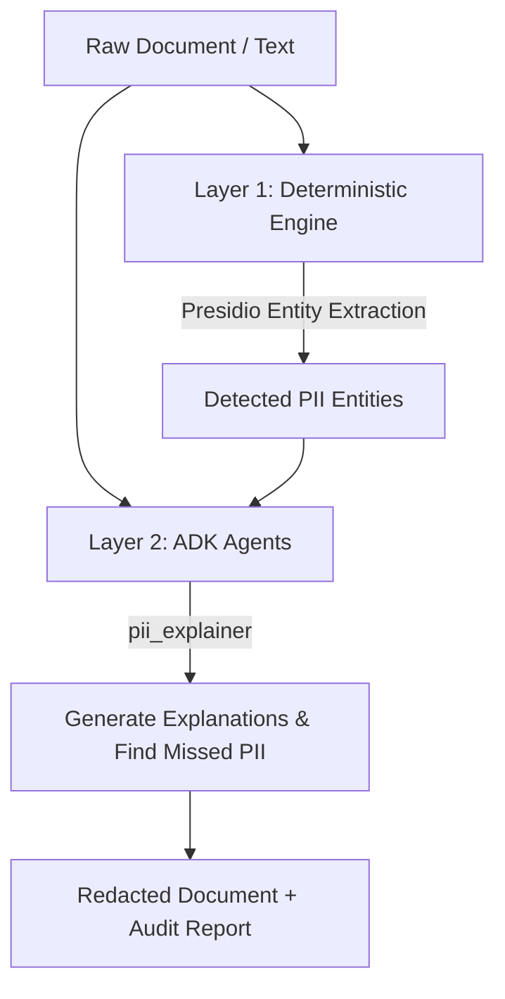

# Conseal Backend

Conseal is a privacy-first document anonymization engine that provides explainable PII (Personally Identifiable Information) redaction and independent privacy auditing.

---

## Architecture

Conseal uses a **Dual-Layer Protection** model to ensure both high-speed deterministic redaction and intelligent contextual reasoning:



### 1. Layer 1: Deterministic Redaction
Uses **Microsoft Presidio** to quickly identify common, structured patterns (like phone numbers, email addresses, and national IDs) with high speed and deterministic accuracy.

### 2. Layer 2: Cognitive ADK Agents
Powered by the **Google Agent Development Kit (ADK)** and `gemini-2.5-flash`, three collaborative agents handle the complex reasoning:
*   **Policy Generator (`policy_generator`)**: Automatically builds a tailored privacy policy based on the document's intended purpose.
*   **PII Explainer (`pii_explainer`)**: Analyzes the detected entities, explains why they should be kept or redacted according to the active policy, and catches contextual PII missed by Layer 1.
*   **Privacy Auditor (`privacy_auditor`)**: Conducts an independent final audit on already-redacted text to verify that no indirect identifiers (e.g., specific company names, niche job roles) remain.

---

## Tech Stack

*   **API Framework**: FastAPI & Uvicorn (Asynchronous, fast, auto-generated OpenAPI documentation).
*   **Agent Framework**: **Google ADK (Agent Development Kit)** — orchestrates conversational context, state, and schema validation.
*   **Deterministic Redaction**: Presidio Analyzer & Presidio Anonymizer.
*   **Document Parsing**: PyMuPDF (High-speed PDF text parsing and visual black-box redaction).
*   **AI Models**: Google Vertex AI Gemini (`gemini-2.5-flash`).

---

## Deployment (Google Cloud Run)

The application is containerized with Docker and deployed as a serverless service on **Google Cloud Run**.

### Why Cloud Run?
*   **Serverless Autoscaling**: Scales down to zero when idle, keeping costs minimal, and scales up instantly to handle heavy PDF redaction loads.
*   **High Timeout Limits**: Unlike traditional edge runtimes, Cloud Run handles long-running AI agent pipelines without premature request timeouts.
*   **Secure Service Identities**: Integrates seamlessly with Google Cloud IAM and Vertex AI APIs using secure service accounts.

### Deploying to Cloud Run
To deploy updates to Google Cloud Run, execute the following command from the root directory:

```bash
gcloud run deploy adk-agent-api \
  --source . \
  --allow-unauthenticated \
  --region=us-central1 \
  --project=fourhack-5f384 \
  --set-env-vars="GOOGLE_GENAI_USE_VERTEXAI=1,GOOGLE_CLOUD_PROJECT=fourhack-5f384,GOOGLE_CLOUD_LOCATION=us-central1"
```

---

## Local Development

### 1. Prerequisites
Ensure you have the service account credentials JSON file (`fourhack-5f384-136980915a0a.json`) placed in the root directory.

### 2. Install Dependencies
```bash
pip install -r requirements.txt
```

### 3. Run the Server
```bash
uvicorn main:app --reload --port 8080
```
Visit `http://localhost:8080/docs` to interact with the API endpoints.
